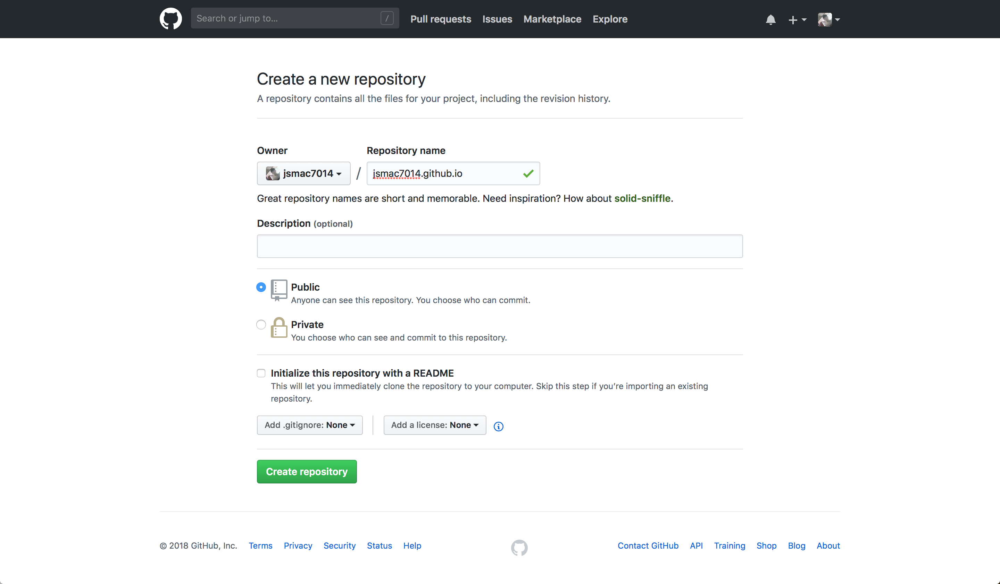
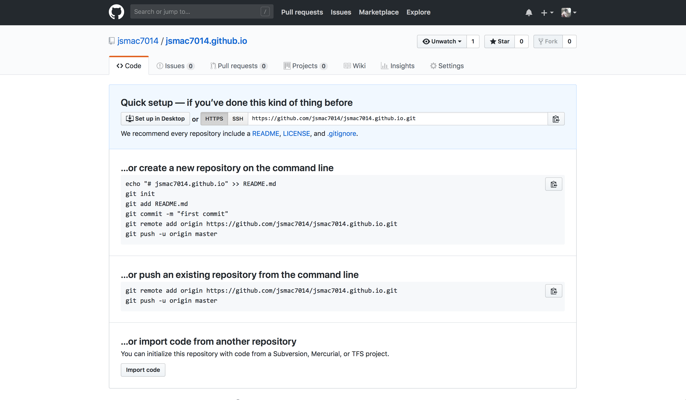

# Github 저장소 만들기

Github 링크 - [https://github.com/](https://github.com/)

## 1. 가입을 해주세요

## 2. New Repository 버튼을 눌러주세요

## 3. Github Repository를 아래 설명을 보고 만들어주세요

Repository Name을 `{github-id}.github.io` 와 같은 형식으로 써주세요

## 4. Git Repository 생성 완료

이렇게 깃허브 저장소가 생성된 것을 볼 수 있습니다.
