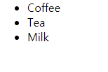

# HTML 태그

HTML은 `<` 로 시작해서 `>` 로 끝나는 `태그(tag)` 로 이루어져 있습니다. \
일반적으로 여는 태그와 닫는 태그가 쌍으로 이루어져 있으며,
여는 태그는 `<html>` 끝 태그는 `</html>` 과 같은 모양을 가지고 있습니다.

이때 여는 태그와 닫는 태그의 순서는 일치해야합니다.

예를 들어

```html
<div><p>text</div></p>
```

> 시작 태그와 닫는 태그의 순서가 올바르지 않은 코드 예시

위 코드는 올바르지 않은 코드입니다. \
`div` 태그 안에 `p` 태그가 들어 있지만 닫는 태그를 `p` 태그부터가 아닌 `div` 태그부터 작성했기 때문입니다.

위 코드를 올바르게 고치면 다음과 같습니다.

```html
<div><p>text</p></div>
```

> 시작 태그와 닫는 태그의 순서가 올바른 코드

이외에도 홀로 쓰이는 `홑 태그(self-closing tag)`가 존재하며,
`<br>`, ``, `<input>` 등이 그 예입니다. \
이들은 여는 태그와 닫는 태그로 이루어져 있지 않고, 단일로 이루어져 있습니다.

홑 태그의 사용 예시는 다음과 같습니다.

```html
<div>
  Text1
  <br>
  Text2
</div>
```

> 홑 태그의 사용 예시

태그는 태그 이름 이외에도 속성, 내용등이 포함될 수 있으며 이를 포함한 보편적인 형태는 다음과 같습니다.

```html
<tag attribute="value1" attribute2="value2">content</tag>
```

위 코드는 어디까지나 예시로 작성된 것이며, 실제 html 요소는 아닙니다만 \
앞으로 배우실 html 태그의 형태를 알려드리기 위해 가져왔습니다.

`attribute`, `attribute2` 는 해당 태그의 속성을 의미하며, \
해당 속성에 `"value"`, `"value2"` 등의 값을 넣는 것으로 태그의 속성을 변경할 수 있습니다. \
속성을 변경하지 않을 경우, 해당 태그의 기본 속성이 적용됩니다.

속성에 적용할 값은 위와 같이 `"` 로 감싸는게 일반적입니다

이제 html의 몇몇 태그들을 개별적으로 알아봅시다.

## 제목 태그

***

제목 태그는 말 그대로 제목을 나타날때 사용하는 태그입니다. \
`<h1>`, `<h2>`, `<h3>`, `<h4>`, `<h5>`, `<h6>` 이며, 예시는 다음과 같습니다.

```html
<h1>this is h1</h1>
<h2>this is h2</h2>
<h3>this is h3</h3>
<h4>this is h4</h4>
<h5>this is h5</h5>
<h6>this is h6</h6>
```


> 제목 태그 예시

제목 태그의 크기는 태그 이름에서 `h`뒤의 숫자가 클수록 작아집니다.

> Note: 앞으로 나올 예시 코드는 분량상
> ```html
> <!DOCTYPE html>
> <html>
>   <head>
>   </head>
>   <body>
>   </body>
> </html>
> ```
> 위 코드를 생략합니다. 모든 코드는 `body` 안에 작성되어있다고 생각하시고 보시길 바랍니다.
> 
> 즉, 위의 예시를 실제 html 코드로 실습하시려면 다음과 같이 작성하시면 됩니다.
> ```html
> <!DOCTYPE html>
> <html>
>   <head>
>   </head>
>   <body>
>     <h1>this is h1</h1>
>     <h2>this is h2</h2>
>     <h3>this is h3</h3>
>     <h4>this is h4</h4>
>     <h5>this is h5</h5>
>     <h6>this is h6</h6>
>   </body>
> </html>
> ```

## 본문 태그

본문을 작성하는데 사용되는 태그는 다양합니다. \
여기선 자주 사용되는 `<div>`, `<p>`, `<br>` 정도만 짚도록 하겠습니다.

### `<div>` 태그

`div` 태그는 블록 태그입니다. \
이 태그에 스타일을 적용해 웹 사이트의 구조를 만들기도 하고, \
단순히 구문용으로 사용하기도 하는 등, 굉장히 많이 사용됩니다.

### `<p>` 태그

`p` 태그는 문단 태그로 텍스트를 감싸는 태그입니다. \
이 태그를 사용하지 않고 텍스트를 작성해도 문제는 없지만, 텍스트라는 명확한 의미를 위해 사용하는 경우도 많습니다.

`div` 태그와 마찬가지로 블록 태그지만, 텍스트만을 위한 태그이기 때문에 \
웹 사이트의 구조를 만들거나 하는데에는 부적합 합니다.

### `<br>` 태그

`br` 태그는 줄 바꿈 태그입니다. html에선 공백(white-space)이 무시되기 때문에

```html
<p>
  text
  text
</p>
```


위처럼 코드에서 줄바꿈을 해도 웹 브라우저에선 `text text` 와 같이 나오게 됩니다.

따라서 줄바꿈을 하고 싶을경우 `<br>` 태그를 사용합니다.

```html
<p>
  text
  <br>
  text
</p>
```


우리가 원하던대로 줄바꿈 되어서 나오는 것을 확인할 수 있습니다.

### 알아두세요

Lorem Ipsum이란 출판, 그래픽 분야에서 사용하는 채우기용 텍스트로,
의미 없는 글자들을 나열해 사람들이 전체적인 프레젠테이션이나 디자인보다
텍스트에 집중하는 상황을 막아줍니다.

아래는 가장 일반적인 Lorem Ipsum 텍스트입니다.

```text
Lorem ipsum dolor sit amet, consectetur adipisicing elit, sed do eiusmod tempor incididunt
ut labore et dolore magna aliqua. Ut enim ad minim veniam, quis nostrud exercitation ullamco
laboris nisi ut aliquip ex ea commodo consequat. Duis aute irure dolor in reprehenderit in
voluptate velit esse cillum dolore eu fugiat nulla pariatur. Excepteur sint occaecat
cupidatat non proident, sunt in culpa qui officia deserunt mollit anim id est laborum.
```

## 앵커 태그

***

앵커(anchor) 태그는 웹 페이지를 서로 연결하는 태그입니다.
여러분이 흔히 보실 수 있는 `"링크를 눌러서 이동"` 이 대표적인 예시입니다.
만약 앵커 태그가 없었다면, 여러분은 모든 주소를 직접 주소창에 입력해야 했을 것입니다.

앵커 태그는 html에서 `a` 로 표현됩니다.

아래는 일반적인 a 태그의 사용 예시입니다.

```html
<a href="url">this is anchor</a>
```

브라우저에서 위 예시의 모습은 다음과 같습니다.


위에서 말했듯이 일반 링크의 모습입니다.

앵커 태그는 클릭시 `href` 속성의 url로 이동하게 됩니다. \
원하시는 분들은 자신이 자주 이용하는 사이트의 URL을 위 예시의 `url` 에 넣어보고 클릭해보시길 바랍니다.

이외에도 `a` 태그를 페이지 내부 이동에 사용할 수 있습니다.

예시 코드를 보도록 합시다.

```html
<a href="#chapter1">jump to chapter1</a>
<a href="#chapter30">jump to chapter30</a>

<h1 id="chapter1">Chapter 1</h1>
<p>text</p>
<h1>Chapter 2</h1>
<p>text</p>
...
<h1 id="chapter30">Chapter 30</h1>
<p>text</p>
```

이런식으로 다른 요소의 id를 `href` 속성에 `#id` 로 넣어줄 경우 링크를 클릭하면 스크롤이 해당 id를 가진 요소가 있는곳으로 즉시 이동하게 됩니다.

## 목록 태그

***

목록 태그는 `<ol>`, `<ul>`, `<dl>` 총 3가지 종류가 있습니다.

* `<ol>` : ordered list의 약자로, 숫자나 알파벳 등 순서가 있는 목록을 만드는 데 사용합니다.
* `<ul>` : unordered list의 약자로, 순서가 필요없는 목록을 만드는 데 사용합니다.
* `<dl>` : definition list의 약자로, 사전처럼 설명하는 목록을 만드는 데 사용합니다.

`<ol>` 과 `<ul>` 의 각 항목을 나열할때는 `<li>`(list item) 태그를 사용합니다.

각 태그에 대해 알아보도록 하겠습니다.

### 목록 태그 - `<ol>` 태그

```html
<ol>
  <li>Coffee</li>
  <li>Tea</li>
  <li>Milk</li>
</ol>
```


> `<ol>` 태그의 예시

위와 같이 각 요소 앞에 순서가 붙게 됩니다. \
앞에 붙는 순서는 `type` 속성값을 이용해 변경할 수 있으며, 사용할 수 있는 종류는 다음과 같습니다.

* `1` : 숫자를 이용해 순서를 붙입니다 (1, 2, 3...)
* `A` : 알파벳(대문자)를 이용해 순서를 붙입니다 (A, B, C...)
* `a` : 알파벳(소문자)를 이용해 순서를 붙입니다 (a, b, c...)
* `I` : 로마 숫자(대문자)를 이용해 순서를 붙입니다 (I, II, III...)
* `i` : 로마 숫자(소문자)를 이용해 순서를 붙입니다 (i, ii, iii...)

`<ol>` 태그에는 `1` 이 기본 속성이며, 이 중 `A` 를 적용한 예는 다음과 같습니다

```html
<ol type="A">
  <li>Coffee</li>
  <li>Tea</li>
  <li>Milk</li>
</ol>
```


> `<ol>` 태그의 `type` 속성에 `A` 를 적용한 예시

또한 `start` 속성을 이용해 시작하는 값을 조절할 수도 있습니다.

```html
<ol start="10">
  <li>Coffee</li>
  <li>Tea</li>
  <li>Milk</li>
</ol>
```


> `<ol>` 태그의 `start` 속성을 이용해 시작값을 변경한 예시

위의 예시는 기존의 1부터 시작하던 시작값을 10으로 변경한 예시입니다

### 목록 태그 - `<ul>` 태그

```html
<ul>
  <li>Coffee</li>
  <li>Tea</li>
  <li>Milk</li>
</ul>
```



> `<ul>` 태그의 예시

마찬가지로 앞의 모양을 변경할 수 있지만, 스타일을 이용해서 적용해야 합니다. \
스타일에 대한 자세한 내용은 3장에서 배우겠지만, 이번엔 일반 속성처럼 이용하도록 합시다.

아래는 `style` 속성에 적용 가능한 스타일의 목록입니다.

* `list-style-type: disc`: 기본 속성이며, 동그란 점이 붙습니다.
* `list-style-type: circle`: 가운데가 빈 동그란 점이 붙습니다.
* `list-style-type: square`: 네모난 점이 붙습니다.
* `list-style-type: none`: 아무것도 붙지 않습니다.

`style` 속성에 `list-style-type: circle` 을 적용한 예시는 다음과 같습니다.

```html
<ul style="list-style-type: circle">
  <li>Coffee</li>
  <li>Tea</li>
  <li>Milk</li>
</ul>
```


> `<ul>` 태그의 `style` 속성에 `list-style-type: circle` 을 적용한 예시

### 목록 태그 - `<dl>` 태그

```html
<dl>
  <dt>Coffee</dt>
  <dd>black hot drink</dd>
  <dt>Milk</dt>
  <dd>white cold drink</dd>
</dl>
```


> `<dl>` 태그의 예시

`<dl>` 태그는 `<li>` 태그 대신 `<dt>` 와 `<dd>` 태그를 이용합니다.

`<dt>` 태그는 용어에 해당하고, `<dd>` 태그는 위의 용어에 대한 설명에 해당합니다.

## 테이블 태그

***

### 테이블 태그 속성
