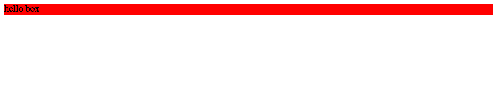
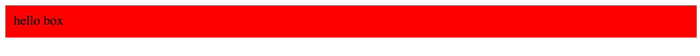
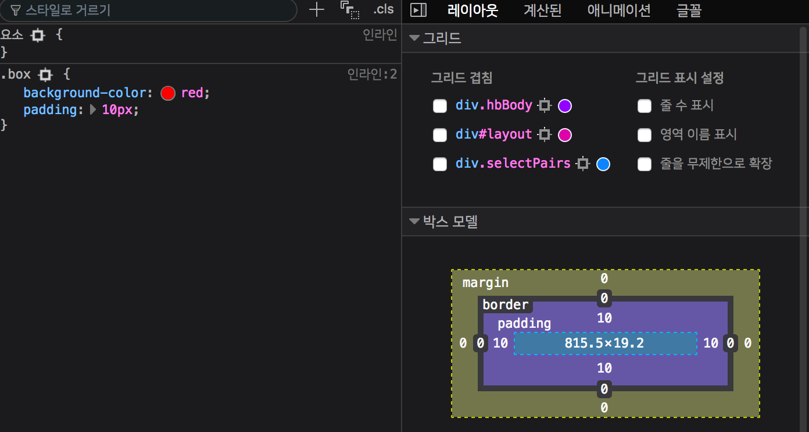
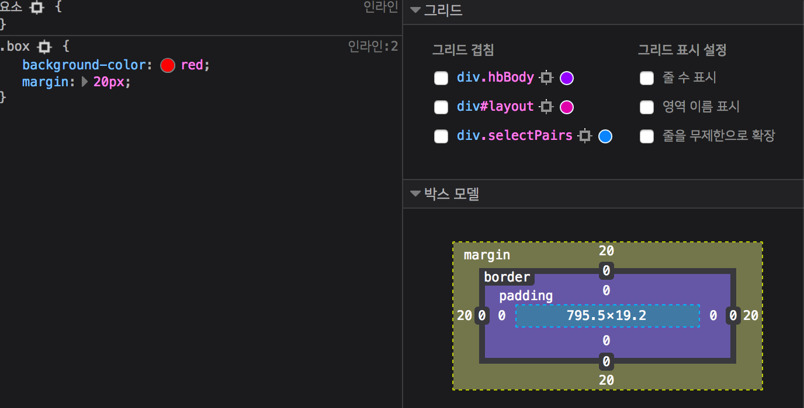
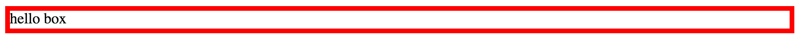

# CSS 박스모델

이번 장에서는 박스모델에 대해서 알아보겠습니다.\


> [출처: https://pressupinc.com/blog/2014/01/whats-wrong-css-box-model-fix/]

여러분들이 웹 브라우저에서 개발자도구를 켜고 하나의 요소를 선택하면 이러한 모양의 그림이 나올 것 입니다.

`div` 태그를 이용하여 박스모델에 대해서 설명하겠습니다.

## Content

```html
//코드 2-1
<div class="box">Hello Box</div>
```

```html
//코드 2-1.2
.box{
    background-color: red;
}
```

### 코드 2-1 실행결과


`background-color: red`를 적용시켜 `width`와 `height`가 차지하는 공간만큼 색을 칠한 것을 볼 수 있습니다. 이와 같이 빨간색으로 칠해진 부분이 `content` 입니다. 

## Padding(내부여백)

```css
//코드 2-2.1
.box{
    background-color: red;
    padding: 10px
}
```

### 코드 2-2 실행결과




`코드 2-1.2` 에 `padding: 10px`를 추가하면 빨간색의 크기가 커진 것을 볼 수 있습니다.
`padding`은 내부여백을 의미합니다. `padding-top`, `padding-right`, `padding-bottom` , `padding-left`와 같이 위,오른쪽, 아래, 왼쪽에 따로 내부여백을 지정할 수 있습니다.

```css
//코드2-2.2
.box{
    padding-top: 10px;
    padding-right: 10px;
    padding-bottom: 10px;
    padding-left: 10px;
}
```

만약에 `코드2-2.2`와 같이 코드를 짜게되면 코드가 길어지고 보기 불편해집니다.\
다행히도 `padding` 하나에 `top`, `right`, `bottom`, `left` 속성을 한꺼번에 지정할 수 있습니다.

```css
//코드 2-2.3
.box{
    padding: 10px 10px 10px 10px;
}
```

적용되는 순서는 `top`, `right`, `bottom`, `left` 순 입니다. 간단하게 시계방향순이라고 생각하시면 됩니다.

```css
//코드 2-2.4
.box{
    padding-top: 20px;
    padding-right: 10px;
    padding-bottom: 20px;
    padding-left: 10px;  
}
```

`코드 2-2.4`와 같이 `top`,`bottom`의 값이 같고 `left`, `right`의 값이 같다고 가정해봅시다.\
이럴 경우에는 어떻게 축약 할 수 있을까요?

```css
//코드 2-2.5
.box{
    padding: 20px 10px;
}
```

`코드 2-2.5` 와 같이 작성하면 상하와 좌우의 값을 따로 줄 수 있습니다.

## Margin (외부여백)

`margin`의 기본적인 부분은 `padding`과 동일합니다.\ 
`padding`과 동일하게 코드를 축약 할 수 있습니다.

```css
//코드 2-3.2
.box{
    background-color: red;
    margin: 20px;
}
```

### 코드 2-3 실행결과



전 코드에서 `padding`을 지우고 `margin: 20px`를 작성합니다.\
`padding`을 없애서 빨간색 부분은 줄어들고 기존 위치에서 `20px` 이동한 것을 볼 수 있습니다.

## Border

```css
//코드 2-4
.box{
    border: 5px solid red;
}
```

### 코드 2-4 실행결과



`border: <두께> <선 유형> <색깔>` 이런 식의 구조로 되어있습니다.\
선 유형에는 `solid`, `dotted`, `dashed`, `double` 등이 있습니다.\
자세한 내용은 `https://www.w3schools.com/css/css_border.asp`을 참고해주세요.