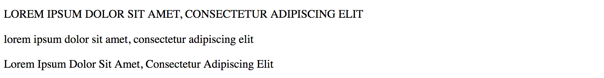

# CSS 스타일 속성

## color
```html
//코드3-1.1
<p id="title">Hello World</p>
```
```
//코드3-1.2
#title{
    color: red;
}
```
`color`는 문자의 색깔을 지정할 수 있게해줍니다.

## text-align
``` html
//코드3-1.1
<p id="title">Hello World</p>
```
```
//코드3-1.2
#title{
    color: red;
    text-align: center
}
```
`text-align`의 값에는 `center`,`left`,`right` 이 있습니다.

## text-transform
```html
//코드 3-2.1
<p id="title-1">Lorem ipsum dolor sit amet, consectetur adipiscing elit</p>
<p id="title-2">Lorem ipsum dolor sit amet, consectetur adipiscing elit</p>
<p id="title-3">Lorem ipsum dolor sit amet, consectetur adipiscing elit</p>
```
```
//코드 3-2.2
#title-1{
    text-transform: uppercase;
}
#title-2{
    text-transform: lowercase;
}
#title-3{
    text-transform: capitalize;
}
```
#### 코드3-2 실행결과


## width & height

```html
//코드 3-3.1
<div class="box"></div>
```
```
//코드 3-3.2
.box{
    width: 100px;
    height: 100px;
    border: 1px solid black;
}
```
#### 코드3-3 실행결과


## background
 `background`에는 여러가지 속성이 통합되어 있는 속성입니다.

 `background-color`, `background-image`, `background-position`, `background-repeat`등이 `background`의 내부속성입니다.
 위의 속성들을 한꺼번에 아래와 같이 사용할 수 있습니다.\
 `background: {background-color} {background-image} {background-repeat} {background-position}`